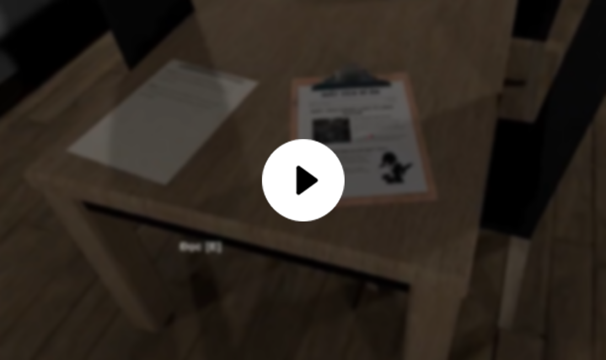

# Cult

- Category: Horror Game
- Language: Vietnamese

## Trailer

## Gameplay

## Story line
The main character in the game is a young journalist, like many other journalists, he also carries with him the curiosity about mysterious events. Set in the village of Kazan, a place where numerous mysterious disappearances have occurred with no solutions. The village is surrounded by walls and has only one entrance and exit. This is a mystery that any journalist would want to unravel, including the main character.

However, journalist Alice took a step ahead, but she also fell into an uncertain situation, with no information after her arrival in the village of Kazan. Mystery upon mystery, the main character can no longer wait and decides to investigate on his own.